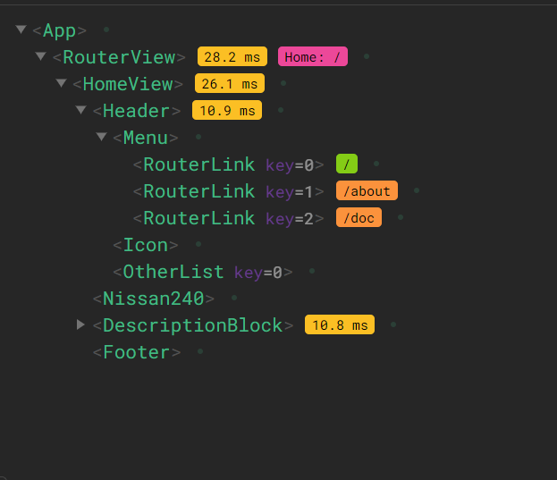
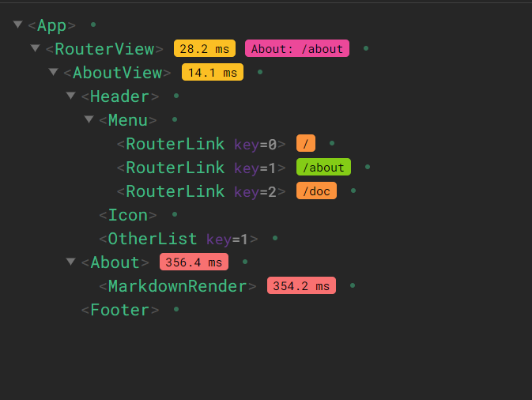
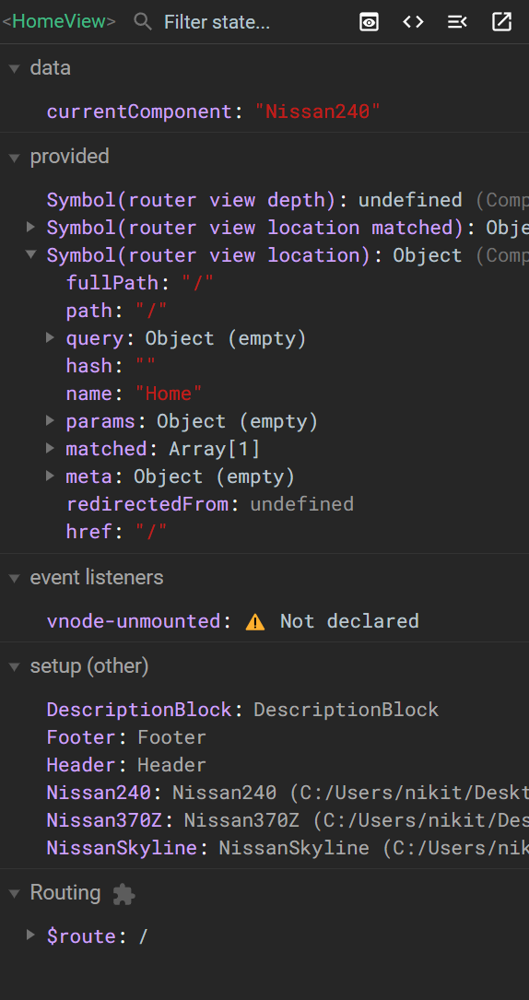
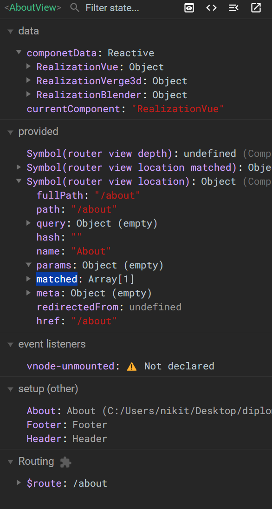

# Vue 3
***
Vue 3 - это мощный инструмент для создания пользовательских интерфейсов, который отличается высокой производительностью и гибкостью. Он предоставляет разработчикам возможность создавать сложные веб-приложения, поддерживает современные веб-технологии и легко интегрируется с другими инструментами и библиотеками

Одно из ключевых нововведений Vue 3 — это компилятор vite, который значительно ускоряет процесс разработки и уменьшает размер конечного продукта. Кроме того, Vue 3 предлагает новые API для жизненного цикла компонентов, что даёт разработчикам больше контроля над поведением компонентов.

Обновлённый рендерер Vue 3 использует виртуальный DOM для повышения производительности и эффективности обновления интерфейса. Благодаря этому приложения, созданные на базе Vue 3, работают быстрее и отзывчивее.

Улучшения в области реактивности позволяют более эффективно отслеживать изменения данных, что облегчает управление состоянием приложения.

Поддержка TypeScript упрощает написание типовых приложений и помогает избежать ошибок на этапе разработки.

Таким образом, Vue 3 является отличным выбором для создания современных и высокопроизводительных веб-приложений.

# Структура Vue проекта

## Структтура Home страницы HomeView.vue



## Структура About страницы AboutView.vue



## Параметры 

### Параметры HomeView


### Параметры AboutView


# Код основных компонентов Vue проекта

## Код компонента VUE3 кнопки навигации между элементами

```
<template>
    <div class="ModelListContainer">
        <button class="ListButton" @click="changeComponent(ChangeCompA)">{{ NameCompA }}</button>
        <button class="ListButton" @click="changeComponent(ChangeCompB)">{{ NameCompB }}</button>
        <button class="ListButton" @click="changeComponent(ChangeCompC)">{{ NameCompC }}</button>
    <component :is="currentComponent" />
    </div>
  </template>
  
  <script>
export default {
    props: ['NameCompA',
            'NameCompB',
            'NameCompC',
            'ChangeCompA',
            'ChangeCompB',
            'ChangeCompC'],
   methods: {
    changeComponent(component) {
      console.log(component)
      this.$emit('componentChange', component);
    }
  }
  };
  </script>
  
<style>
  @import './Styles/MenuIcon.css';
  @import './Styles/HeaderСontainers.css';
</style>

```
## Код компонента VUE3 кнопки навигации между страницами

```
<script setup>
    import { RouterLink } from 'vue-router';
    import {  ref, computed } from 'vue';

</script>
<template>
    <div class="MenuContainer">
      <RouterLink v-for="(button, index) in buttons" :key="index" :to="button.route">
        <button class="Button">
          {{ button.text }}
        </button>
      </RouterLink>
    </div>
  </template>
  
  <script>
  export default {
    data() {
      return {
        buttons: [
          { text: 'Home', route: '/' },
          { text: 'Аbout project', route: '/about' },
          { text: 'Doc', route: '/doc' }
        ]
      };
    }
  };
  </script>
  
  <style>
  @import './Styles/MenuIcon.css';
  @import './Styles/HeaderСontainers.css';
  </style>

```

## Код компонента для рендера markdown в html


```
<template>
    <div v-html="markdown.render(source)"></div>
  </template>

<script setup>
import MarkdownIt from "markdown-it";
import MarkdownItAbbr from "markdown-it-abbr";
import MarkdownItAnchor from "markdown-it-anchor";
import MarkdownItFootnote from "markdown-it-footnote";
import MarkdownItHighlightjs from "markdown-it-highlightjs";
import MarkdownItSub from "markdown-it-sub";
import MarkdownItSup from "markdown-it-sup";
import MarkdownItTasklists from "markdown-it-task-lists";
import MarkdownItTOC from "markdown-it-toc-done-right";

const markdown = new MarkdownIt()
  .use(MarkdownItAbbr)
  .use(MarkdownItAnchor)
  .use(MarkdownItFootnote)
  .use(MarkdownItHighlightjs)
  .use(MarkdownItSub)
  .use(MarkdownItSup)
  .use(MarkdownItTasklists)
  .use(MarkdownItTOC);

defineProps({
  source: {
    type: String,
    default: ""
  }
});
</script>
<style>
@import 'highlight.js/styles/default.css';
</style>

```

## Код VUE3 копонета для динамического отображения контента на странице About и Doc

```
<script setup>
        import MarkdownRender from './MarkdownRender.vue'
       
</script>

<template>
    <div class="RealizationContainer">
        <MarkdownRender  :source="RealizationMarkdownContent"></MarkdownRender>
    </div>
</template>

<script>
export default {
    name: 'About',
    props: {
        realizationType:{
                default(){
                    return {}
                }
            }
        }, 
    data() {
        return {
            CurrentType: {}, 
            RealizationMarkdownContent: '# Hello World'
        };
    },
    mounted() {
        this.loadmd()
    },
    methods:{
        loadmd(){
            fetch(this.Realization.markdownFile)
                .then(response => response.text())
                .then(content => {
                this.RealizationMarkdownContent = content;
            });
        }
    },
    computed:{
        Realization(){
            return this.realizationType 
        }
    },
    watch:{
        Realization:function(){
            this.loadmd()
        }
    }
};
</script>
<style scoped>
.RealizationContainer{
    text-align: justify;
}
</style>

```

## Код компонента VUE3 отображающего 3d контент

```

<template>
    <div :id="containerId">
      <div
        :id="fsButtonId"
        class="fullscreen-button fullscreen-open"
        title="Toggle fullscreen mode"
      ></div>
    </div>
  </template>
  
  <script>
  import { createApp } from '../v3dApp/app';
  
  export default {
    name: 'Nissan240',
  
    created() {
      this.app = null;
      this.PL = null,
  
      this.uuid = window.crypto.randomUUID();
      this.containerId = `v3d-container-${this.uuid}`;
      this.fsButtonId = `fullscreen-button-${this.uuid}`;
      this.sceneURL = '240SX/240SX.gltf';
  
      this.loadApp = async function() {
        ({ app: this.app, PL: this.PL } = await createApp({
          containerId: this.containerId,
          fsButtonId: this.fsButtonId,
          sceneURL: this.sceneURL,
        }));
      }
  
      this.disposeApp = function() {
        this.app?.dispose();
        this.app = null;
  
        // dispose Puzzles' visual logic
        this.PL?.dispose();
        this.PL = null;
      }
  
      this.reloadApp = function() {
        this.disposeApp();
        this.loadApp();
      }
    },
  
    mounted() {
      this.loadApp();
    },
  
    beforeUnmount() {
      this.disposeApp();
    },
  }
  </script>
  
  <style>
  @import '../v3dApp/app.css';
  </style>
  

```

## Код VUE3 компонента "Домашняя страница"

```
<script setup>
    import Header from '../components/Header.vue';
    import Footer from '../components/Footer.vue';
    import Nissan240 from '../components/Nissan240SX.vue';
    import NissanSkyline from '../components/NissanSkyline.vue';
    import Nissan370Z from '../components/Nissan370Z.vue';
    import DescriptionBlock from '../components/DescriptionBlock.vue'

</script>

<template>
    <div class="HomeView" :class="{ expanded: isExpanded }">
        <Header @componentChange="changeComponent"></Header>
        <component :is="currentComponent" />
        <DescriptionBlock></DescriptionBlock>
        <Footer></Footer>
    </div>
</template>
<script>
  export default {
    data() {
      return {
        currentComponent: 'Nissan240'
      };
    },
    components: {
      Nissan240,
      NissanSkyline,
      Nissan370Z
    },
    methods: {
      changeComponent(component) {
        this.currentComponent = component;
      }
    }
  };
</script>

<style scoped>
.v3d-container {
      position: absolute;
      width: 100%;
      height: 50%;
  }
.HomeView{
      position: absolute;
      top: 5%;
      left: 0%;
      right: 0%;
      background-color:rgb(50, 50, 50);
      width: 100%;
      height: 100vh;
}
.DescriptionBlock{
    position: absolute;
    top: 50%;
    left: 0;
    right: 0;
    height: 20%;
    background-color:rgb(50, 50, 50);
    transition: 1s, border-radius 0.5s;
    opacity: 0.55; 
}
.DescriptionBlock.expanded {
  height: auto;
  top: 65px ;
  opacity: 1;
}
</style>

```